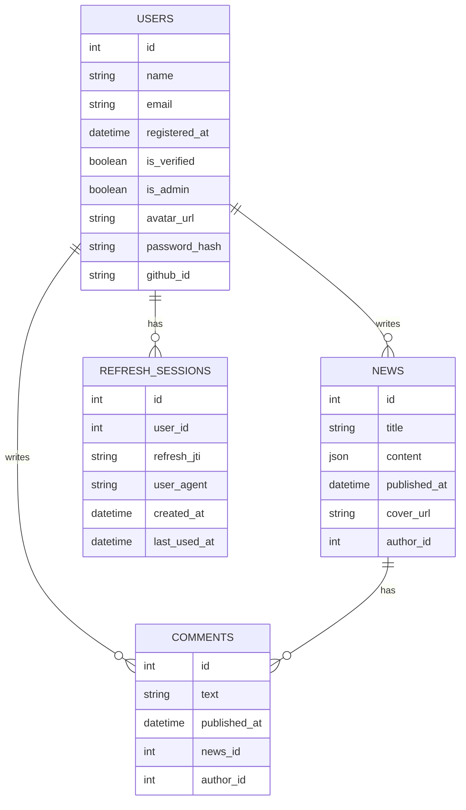

# FastAPI News CRUD

CRUD API для пользователей, новостей и комментариев на базе FastAPI + SQLAlchemy + Alembic
с авторизацией (JWT), refresh-сессиями и GitHub OAuth.

## Требования

- Python 3.10+
- PostgreSQL 13+

## Быстрый старт

```bash
python -m venv .venv
source .venv/bin/activate
pip install -r requirements.txt

set -a && source .env && set +a

alembic upgrade head

uvicorn app.main:app --reload
```

## Архитектура

- `app/main.py` — точка входа FastAPI
- `app/models.py` — SQLAlchemy модели
- `app/schemas.py` — Pydantic схемы
- `app/routers/*` — CRUD ручки
- `app/db.py` — подключение к БД и dependency
- `app/auth.py` — хэширование паролей, JWT
- `app/dependencies.py` — проверки ролей и владельцев
- `app/routers/auth.py` — регистрация, логин, refresh, logout, GitHub OAuth

### Модель данных



### Миграции

1. `001_create_tables.py` — создаёт таблицы и связи, включая каскадное удаление комментариев при удалении новости.
2. `002_seed_data.py` — добавляет моковые данные (2 пользователя, 1 новость, 1 комментарий).
3. `003_add_auth_fields.py` — добавляет поля авторизации и таблицу refresh-сессий.

## Ролевая модель

Кратко описана в `docs/auth`.

## Примеры запросов

### Авторизация

Регистрация:
```bash
curl -X POST http://localhost:8000/auth/register \
  -H "Content-Type: application/json" \
  -d '{"name":"Ivan","email":"ivan@example.com","password":"secret"}'
```

Логин:
```bash
curl -X POST http://localhost:8000/auth/login \
  -H "Content-Type: application/json" \
  -d '{"email":"ivan@example.com","password":"secret"}'
```

Refresh токена:
```bash
curl -X POST http://localhost:8000/auth/refresh \
  -H "Content-Type: application/json" \
  -d '{"refresh_token":"<token>"}'
```

Logout:
```bash
curl -X POST http://localhost:8000/auth/logout \
  -H "Content-Type: application/json" \
  -d '{"refresh_token":"<token>"}'
```

Сессии пользователя:
```bash
curl http://localhost:8000/auth/sessions \
  -H "Authorization: Bearer <access_token>"
```

GitHub OAuth (редирект):
```bash
curl -v http://localhost:8000/auth/github/login
```

> Чтобы получить доступ к админским ручкам, установите `is_admin = true`
> пользователю в БД (например, через SQL-клиент).

### Пользователи (только админ)

Создать пользователя:
```bash
curl -X POST http://localhost:8000/users \
  -H "Authorization: Bearer <access_token>" \
  -H "Content-Type: application/json" \
  -d '{"name":"Ivan","email":"ivan@example.com","password":"secret","is_verified":true,"is_admin":false}'
```

Получить список пользователей:
```bash
curl http://localhost:8000/users \
  -H "Authorization: Bearer <access_token>"
```

### Новости

Создать новость (только для верифицированного пользователя):
```bash
curl -X POST http://localhost:8000/news \
  -H "Authorization: Bearer <access_token>" \
  -H "Content-Type: application/json" \
  -d '{"title":"Hello","content":{"text":"Hi"}}'
```

Обновить новость:
```bash
curl -X PUT http://localhost:8000/news/1 \
  -H "Authorization: Bearer <access_token>" \
  -H "Content-Type: application/json" \
  -d '{"title":"Updated title"}'
```

### Комментарии

Создать комментарий:
```bash
curl -X POST http://localhost:8000/comments \
  -H "Authorization: Bearer <access_token>" \
  -H "Content-Type: application/json" \
  -d '{"text":"Nice!","news_id":1}'
```

Обновить комментарий:
```bash
curl -X PUT http://localhost:8000/comments/1 \
  -H "Authorization: Bearer <access_token>" \
  -H "Content-Type: application/json" \
  -d '{"text":"Updated"}'
```

Удалить новость вместе с комментариями:
```bash
curl -X DELETE http://localhost:8000/news/1 \
  -H "Authorization: Bearer <access_token>"
```

## Сценарий использования

1. Запустить сервис и выполнить миграции.
2. Создать пользователей.
3. Создать новость от верифицированного автора.
4. Создать комментарий от другого пользователя.
5. Изменить новость и комментарий.
6. Удалить новость — комментарии удалятся каскадно.
